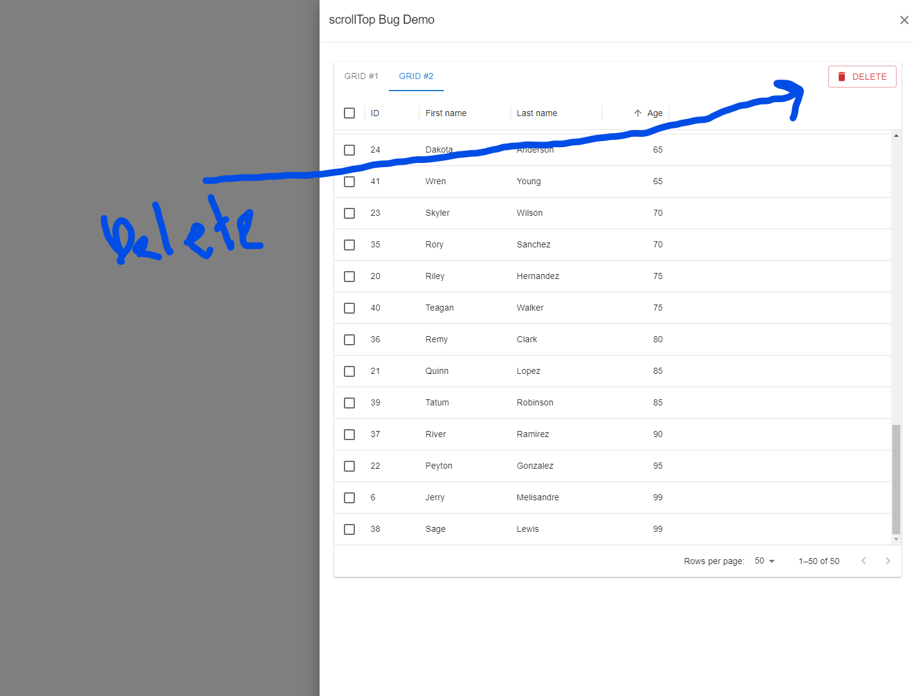

# MUI X Grid Bug Demo

## Table of contents

- [Overview](#overview)
- [The bug](#the-bug)
  - [How to recreate](#how-to-recreate)
    - [Use case 1](#use-case-1)
      - [Screenshots 1](#screenshots-1)
    - [Use case 2](#use-case-2)
      - [Screenshots 2](#screenshots-2)

## Overview

This repo is to recreate a bug I experienced with Material UI X's Data Grid.
I tried to recreate the bug with only the necessary dependencies, styles, and elements. Albeit, because I don't know what's causing the error, some things may be unrelated.

I recreated the bug with two combinations of package versions. The first tries to replicate the packages used when first encountering the error. Said combination can be found on the `main` branch. The second combination tries to use the latest package versions and can be found on the `updated-package-versions` branch.

This bug was discovered when working on a feature for work, in which case we are using Data Grid Premium. However, as I do not have a personal Premium license, this demo uses the free version. It seems both versions encounter the same error.

## The bug

When scrolling to the very bottom of the virtual scrollbar using a scroll wheel then decreasing the number of rows in a Data Grid via clicking a lesser page option or via programmatically deleting rows via some custom UI prompt (such as a Delete button) such that the vertical, virtual scroll bar is no longer needed, the Data Grid will throw the following error on `Chrome`:

```
Cannot set properties of null (setting 'scrollTop')
TypeError: Cannot set properties of null (setting 'scrollTop')
    at http://localhost:3000/static/js/bundle.js:49775:31
    at HTMLDivElement.<anonymous> (http://localhost:3000/static/js/bundle.js:37491:19)
```

The following error on `Firefox`:

```
scrollbar is null
./node_modules/@mui/x-data-grid/components/virtualization/GridVirtualScrollbar.js/GridVirtualScrollbar/onScrollerScroll<@http://localhost:3000/static/js/bundle.js:49775:41
./node_modules/@mui/utils/esm/useEventCallback/useEventCallback.js/useEventCallback/<@http://localhost:3000/static/js/bundle.js:37491:19
```

This bug was actually discovered and reported by another person prior, but the thread was closed as the reporter did not create a simple demo/example of the bug: https://github.com/mui/mui-x/issues/13301

### How to recreate

#### Use case 1

_NOTE: Oddly enough, scrolling to the bottom of the grid / virtual scrollbar
by clicking and dragging the scroll bar down does not produce an error nor does scrolling close to the bottom. The error is only produced by scrolling to the absolute bottom of the scrollbar via scroll wheel in my experience._

1. Open app in either Chrome of Firefox web browser
2. Click OPEN button to open Drawer component featuring two Data Grids
3. Click Grid #2 tab
4. Scroll to the absolute bottom of the data grid using **scroll wheel** (not by dragging scroll bar down with mouse)
5. Change Rows per page option to 10 instead of 50

#### Screenshots 1


#### Use case 2

_NOTE: Weirdly enough, the following steps produce an error far more often
when using Google Chrome in my experience. It may take multiple attempts
to get the error to produce in Firefox._

1. Open app in either Chrome of Firefox web browser
2. Click OPEN button to open Drawer component featuring two Data Grids
3. Click Grid #2 tab
4. Scroll to the absolute bottom of the data grid using **scroll wheel** (not by dragging scroll bar down with mouse)
5. Click the DELETE button (top right, just above Data Grid)\

#### Screenshots 2




